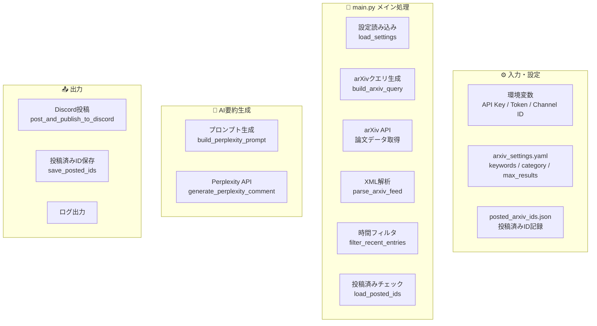

# arXiv2Discord
arXiv APIで取得した論文タイトル・アブストを，GitHub ActionsによってPerplexity APIで要約し，Discordアナウンスチャンネルに自動投稿＆公開します．

## 📚 ドキュメント
- [README.md](./README.md) - プロジェクトの概要と基本的な使い方
- [FAQ](./docs/faq.md) - よくある質問と回答
- [アーキテクチャ](./docs/architecture.md) - システムの構造と設計の詳細
- [ワークフロー](./docs/workflow.md) - 処理の流れとデータフロー
- [環境セットアップ](./docs/env_setup.md) - 環境変数とAPI設定のガイド

---
## ツール仕様
### 概要
`arXiv2Discord`は，arXiv論文を自動収集し，Perplexity AIで日本語要約を生成してDiscordチャンネルに投稿するツールです.
### 特徴
- **自動論文収集**: arXiv APIから指定キーワード・カテゴリで論文を検索
- **AI要約生成**: Perplexity APIを使って日本語で詳細な要約とAIコメントを生成
- **Discord連携**: 要約をDiscordの指定チャンネルに自動投稿・公開（クロスポスト）
- **重複投稿防止**: 投稿済み論文IDを記録し，同じ論文を複数回投稿しない仕組み
- **柔軟な設定**: YAML設定ファイルで検索キーワード，カテゴリ，取得件数，期間を指定可能
### 主要な設定項目
- **環境変数**:
  - `PERPLEXITY_API_KEY`: Perplexity APIキー
  - `PERPLEXITY_MODEL`: 使用するPerplexityモデル名
  - `DISCORD_BOT_TOKEN`: Discord Bot トークン
  - `DISCORD_CHANNEL_ID`: 投稿先DiscordチャンネルID
  - `POSTED_IDS_FILE`: 投稿済みID記録ファイル（デフォルト: `posted_arxiv_ids.json`）
- **設定ファイル** (`arxiv_settings.yaml`):
  - `keywords`: 検索キーワードリスト
  - `category`: arXivカテゴリ（例: `cat:cs.AI`）
  - `max_results`: 最大取得件数
  - `recent_hours`: 検索対象期間（時間）
### 使い方
1. 環境変数，ワークフローのスケジューリングを設定（API キー，Discord トークン等）
2. `arxiv_settings.yaml`にキーワードやカテゴリを設定
3. `python main.py`を実行
4. 新規論文が自動的にDiscordに投稿される
---
## アーキテクチャ

---

## Support

このリポジトリが役に立った/気に入っていただけたら，以下のいずれかの形でサポートしていただけると嬉しいです🙌

- GitHubでのStar⭐
- SNS等でのシェア・紹介
- Buy Me a Coffeeからのご支援

If you find this project useful, you can support it in any of the following ways 🙌

- Give the repository a ⭐️ on GitHub
- Share it on social media or with your friends
- Support me on Buy Me a Coffee

