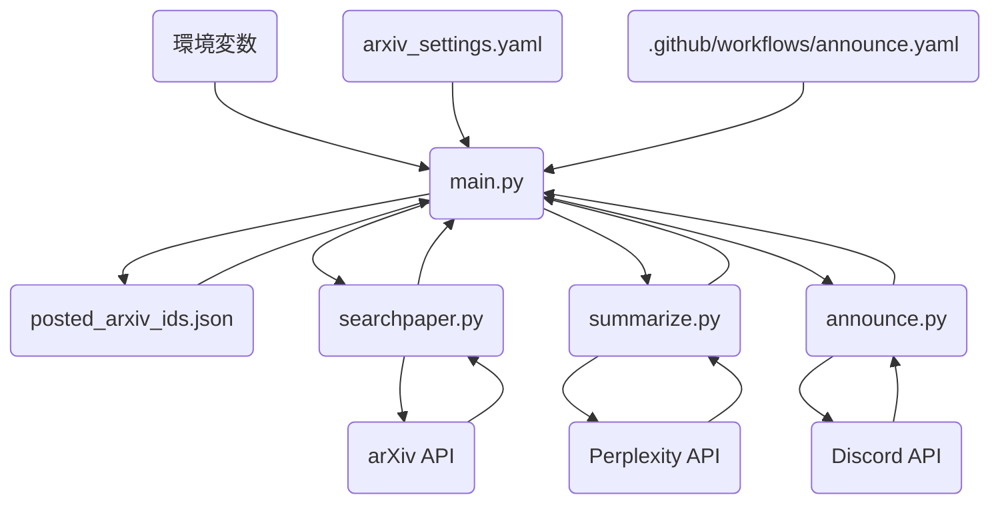

# アーキテクチャドキュメント

## システム概要

arXiv2Discordは，arXiv・Perplexity AI・Discord間でデータを連携するモジュール型パイプラインシステムです．
信頼性・保守性・設定の容易さを重視して設計されています．

## 全体構成図

## コンポーネント詳細

### 1. メイン制御モジュール

**ファイル**: `main.py`

- 全体の処理フローを制御
- arxiv_settings.yamlから設定を読み込み
- posted_arxiv_ids.jsonから投稿済みIDを管理
- searchpaper，summarize，announceの各モジュールを順次呼び出し
- ログ出力とエラー処理

### 2. 論文検索モジュール

**ファイル**: `utils/searchpaper.py`

- arXiv APIへのクエリ実行
- XMLレスポンスの解析
- 論文メタデータ（タイトル，著者，要旨，arXiv ID等）の抽出
- 検索条件に基づく論文取得

### 3. 要約生成モジュール

**ファイル**: `utils/summarize.py`

- Perplexity APIを利用した論文要約
- プロンプト生成と整形
- 日本語での要約出力
- APIレート制限への対応

### 4. 投稿管理モジュール

**ファイル**: `utils/announce.py`

- Discord Webhookへのメッセージ投稿
- 投稿用メッセージの整形
- クロスポスト処理
- エラー時のリトライ処理

### 5. 設定ファイル

**ファイル**: `arxiv_settings.yaml`

- 検索キーワードの定義
- 取得件数や期間の設定
- カテゴリ・フィルタリング条件
- 各種パラメータの管理

### 6. 状態管理ファイル

**ファイル**: `posted_arxiv_ids.json`

- 投稿済み論文IDの記録
- 重複投稿の防止
- JSON形式での永続化

### 7. GitHub Actions自動化

**ファイル**: `.github/workflows/announce.yaml`

- 定期実行スケジュールの設定
- Python環境のセットアップ
- main.pyの自動実行
- 環境変数の設定とシークレット管理

## 処理フロー

1. **起動**: GitHub Actionsまたは手動でmain.pyを実行
2. **設定読み込み**: arxiv_settings.yamlと環境変数から設定取得
3. **論文検索**: searchpaper.pyでarXiv APIから論文を取得
4. **重複確認**: posted_arxiv_ids.jsonと照合し未投稿論文を特定
5. **要約生成**: summarize.pyでPerplexity APIを使い要約作成
6. **Discord投稿**: announce.pyでWebhook経由で投稿
7. **状態更新**: posted_arxiv_ids.jsonに投稿済みIDを記録

## エラー処理

- **設定エラー**: 起動時に検証し即座に終了
- **API通信エラー**: リトライ処理を実施（最大3回）
- **レート制限**: ログ記録後，次の処理へ進む
- **データ解析エラー**: 当該論文をスキップし警告出力
- **権限エラー**: エラーログ出力後，処理終了

## セキュリティ

- **APIキー管理**: 環境変数で管理、GitHub Secretsに保存
- **ファイルパーミッション**: 設定・状態ファイルのアクセス権限管理
- **ログ出力**: APIキーや機密情報の秘匿
- **レート制限**: API利用規約の遵守

## 性能

- **論文検索**: 約2-5秒/回（arXiv API）
- **要約生成**: 約3-8秒/論文（Perplexity API）
- **Discord投稿**: 約1-2秒/論文（Webhook）
- **処理方式**: キーワード別に直列処理
