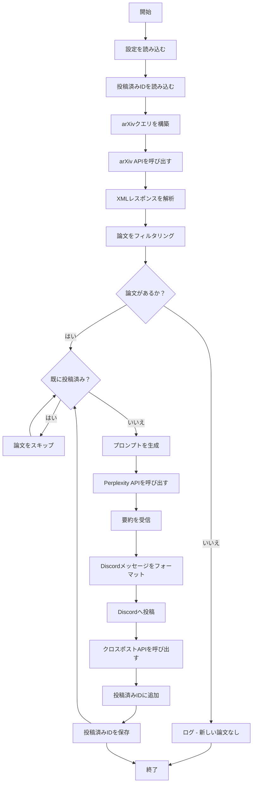

# ワークフローガイド

## 概要
このドキュメントでは，設定の読み込みからDiscordへの論文投稿まで，arXiv2Discordの完全なワークフローについて説明します．

## 実行フロー

### ステップ1: 設定の読み込み
**目的**: 必要な設定とAPI認証情報をすべて読み込む．

**プロセス**:
- 環境変数を読み込む:
  - `PERPLEXITY_API_KEY` - Perplexity API認証
  - `PERPLEXITY_MODEL` - AIモデルの指定
  - `DISCORD_BOT_TOKEN` - Discordボットの認証情報
  - `DISCORD_CHANNEL_ID` - 投稿先チャンネル
  - `POSTED_IDS_FILE` - 投稿済み論文を追跡するファイル
- `arxiv_settings.yaml`を読み込む:
  - 論文検索用のキーワード
  - arXivカテゴリフィルタ
  - 最大取得件数
  - 最近の論文の時間枠
- JSONファイルから過去に投稿した論文IDを読み込む

**主要関数**: `load_settings()`

### ステップ2: arXiv APIクエリの構築
**目的**: 関連する論文を見つけるための検索クエリを構築して実行する．

**プロセス**:
- 以下を使用してarXiv APIクエリURLを構築:
  - 設定ファイルのキーワード
  - カテゴリフィルタ（例: `cat:cs.AI`）
  - 日付範囲（過去N時間の論文）
- arXiv APIへHTTPリクエストを実行
- 論文メタデータを含むXMLレスポンスを受信

**主要関数**: `build_arxiv_query()`

### ステップ3: arXivレスポンスの解析
**目的**: XMLフィードから論文情報を抽出する．

**プロセス**:
- ElementTreeまたは類似ライブラリを使用してXMLレスポンスを解析
- 各論文について以下を抽出:
  - 論文ID（arxiv ID）
  - タイトル
  - 著者
  - 公開日
  - アブストラクト/要約
  - 論文URL
- 抽出したデータを構造化形式（dict/object）で保存

**主要関数**: `parse_arxiv_feed()`

### ステップ4: 最近の論文のフィルタリング
**目的**: 時間枠内の論文のみが処理されることを保証する．

**プロセス**:
- 各論文の公開日をチェック
- 設定された時間枠より古い論文を除外
- フィルタリングされた論文リストを保持

**主要関数**: `filter_recent_papers()`

### ステップ5: 重複チェック
**目的**: 以前に投稿された論文を再投稿しない．

**プロセス**:
- 各論文IDを投稿済みIDのセットと比較
- 既に投稿済みの論文をスキップ
- 新規論文のみを次のステップに渡す

**主要関数**: `check_if_posted()`

### ステップ6: AI要約の生成
**目的**: Perplexity APIを使用して論文の簡潔な要約を生成する．

**プロセス**:
- 論文のタイトルとアブストラクトからプロンプトを構築
- Perplexity APIにリクエストを送信:
  - モデルの指定（設定から）
  - プロンプトの送信
  - APIキーを使用して認証
- AI生成の要約を受信して保存

**主要関数**: `generate_summary()`

### ステップ7: Discordメッセージの作成
**目的**: 投稿用のフォーマットされたメッセージを作成する．

**プロセス**:
- Discordの埋め込み構造を構築:
  - タイトル: 論文タイトル
  - 著者フィールド
  - AI要約
  - 論文へのリンク
  - タイムスタンプ
- フィールド長の制限を確認

**主要関数**: `format_discord_message()`

### ステップ8: Discordへの投稿
**目的**: フォーマットされたメッセージを設定されたDiscordチャンネルに送信する．

**プロセス**:
- Discord APIに接続
- ボットトークンを使用して認証
- 指定されたチャンネルIDにメッセージを送信
- 投稿の成功/失敗を確認

**主要関数**: `post_to_discord()`

### ステップ9: クロスポストの実行
**目的**: メッセージを複数のチャンネルに配信する．

**プロセス**:
- Discordクロスポストエンドポイントを呼び出す
- 設定された対象チャンネルに配信

**主要関数**: `crosspost_message()`

### ステップ10: 投稿記録の更新
**目的**: 将来の重複を防ぐために投稿済み論文を追跡する．

**プロセス**:
- 投稿済みIDセットに論文IDを追加
- JSONファイルを更新:
  - ファイルを読み込む（存在する場合）
  - 新しいIDを追加
  - ファイルに書き戻す
- ファイル書き込み操作を確認

**主要関数**: `update_posted_ids()`

## フローチャート



## エラーハンドリング

### ネットワークエラー
- arXiv APIタイムアウト: 指数バックオフで最大3回リトライ
- Perplexity APIエラー: エラーをログに記録し論文をスキップ
- Discord APIエラー: エラーをログに記録してアラート，1回リトライ

### 無効なデータ
- 論文メタデータの欠落: 警告を出して論文をスキップ
- 不正なAPIレスポンス: ログに記録して続行
- 無効なDiscordチャンネル: 明確なエラーメッセージで即座に失敗

### 実行モード

#### 手動実行
```bash
python main.py
```
- 一度実行して終了
- テストやオンデマンド更新に便利

#### スケジュール実行
- cron（Linux/Mac）を使用:
  ```bash
  0 9 * * * cd /path/to/arxiv2pplx && python main.py
  ```
- タスクスケジューラ（Windows）または類似ツールを使用
- 必要に応じて日次/時間単位で実行

## よくある問題のトラブルシューティング

| 問題 | 症状 | 解決策 |
|------|------|--------|
| 論文が投稿されない | ログに「新しい論文なし」 | arXivクエリ構文を確認，インターネット接続を確認 |
| 重複投稿 | 同じ論文が2回投稿される | `posted_arxiv_ids.json`の整合性を確認 |
| Discord投稿失敗 | 403 Forbiddenエラー | Discordのボット権限を確認 |
| Perplexityエラー | APIがエラーを返す | APIキーの有効性、レート制限を確認 |
| アブストラクトの欠落 | 不完全な要約 | arXivフィード解析ロジックを確認 |
